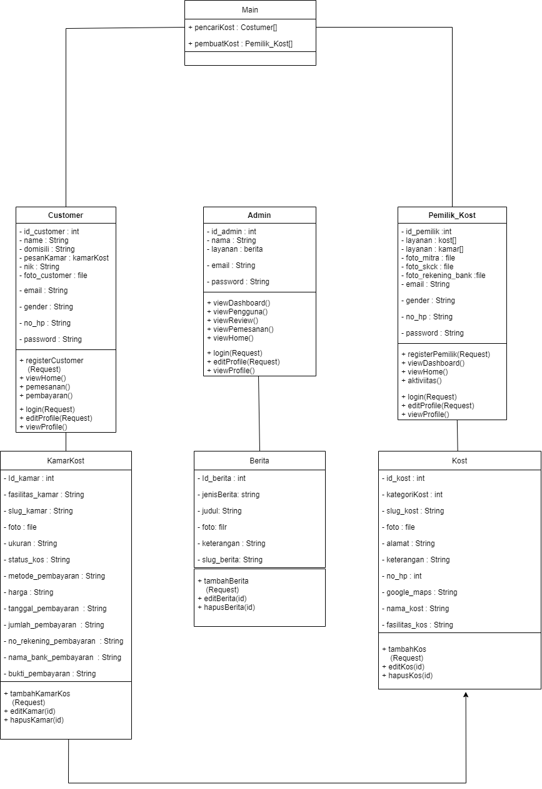
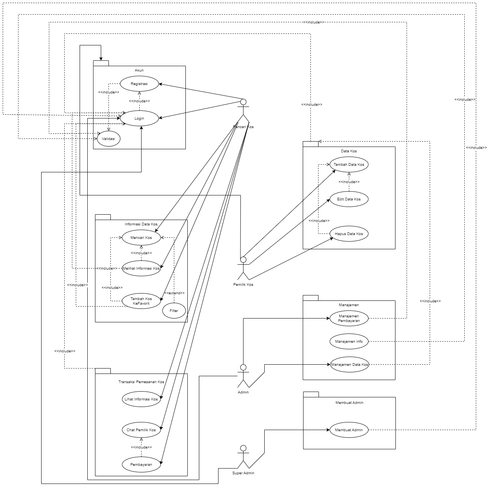
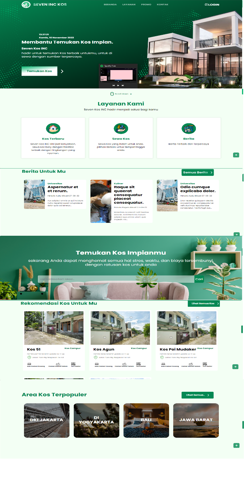
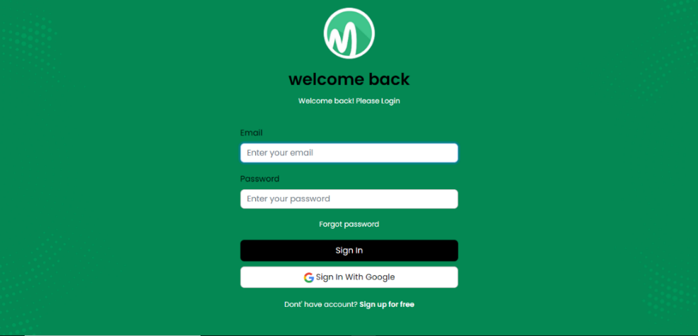
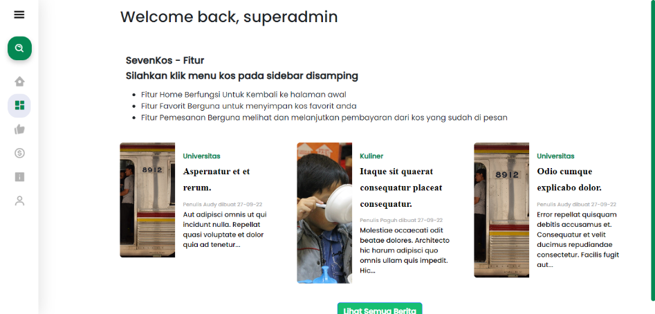

# Seven Kos

Seven Kos adalah Project kerja praktek penyewaan kos-kosan dengan Website Dibuat dengan Framework Laravel dengan Bahasa PHP

## Waktu Pengerjaan

Waktu Pengerjaan dari tanggal 27 July - 27 September

## Diagram

- Diagram Class

- Use Case Diagram

## User

Pada sistem penyewaan kos kosan web memiliki 4 hak akses yaitu:
- Super Admin
- Admin
- Pemilik Kos
- Pencari Kos

## Tampilan

#### Halaman Awal

#### Halaman Login

#### Halaman Dashboard

## Penggunaan API

- [Midtrans](https://midtrans.com/)

- [Indoregion](https://github.com/azishapidin/indoregion)

## Kekurangan
- Pemilik Kos Ataupun Pencari Kos Tidak dapat Mengedit Profil

- Jika Di satu kos terdapat jenis kamar yang berbeda maka Pemilik Kos harus membuat Kos baru Lagi

- Dalam mencari kos belum bisa mencari secara detail (Filter) 

- Pembayaran yang tersambung ke midtrans, jika pembayaran berhasil status pemesanan tidak berubah otomatis

- Ketika Admin Ingin memberikan Info ke User belum Otomatis 

## Authors

- [@PaguhEsatrio](https://github.com/PaguhEsatrio)

- [@valentianoaudy](https://github.com/valentianoaudy)

## Thanks To

